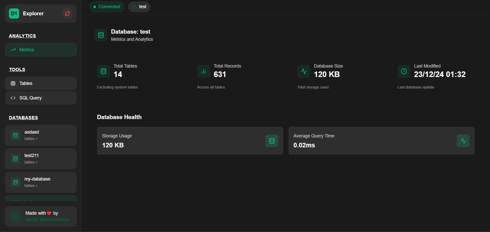
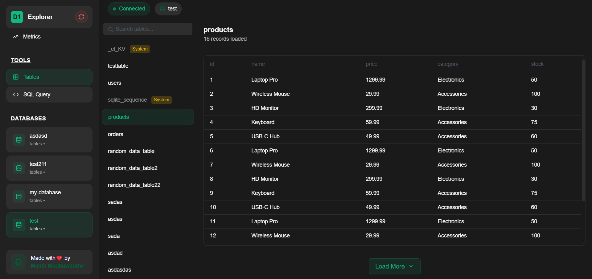

# 🚀 FlareBase Expo D1
A modern web dashboard for managing Cloudflare D1 databases! ⚡

## ✨ Features
- ✅ Execute SQL Queries
- ✅ View Table Structures
- ✅ Monitor Database Metrics
- ✅ Dark Mode Interface
- ✅ Real-time Updates

<div align="center" style="display: flex; gap: 10px;">
  
  
</div>

## 🔥 Fast Deploy
1. Fork this repository
2. Go to Cloudflare Pages
3. Connect your forked repo
4. Set build settings:
```
Framework preset: Next.js
Build command: npx @cloudflare/next-on-pages
Build output directory: .vercel/output/static
```

## ⚙️ Environment Setup

### 1️⃣ Account ID
- Log in to Cloudflare Dashboard
- Find in right sidebar or URL:
```
https://dash.cloudflare.com/<Account ID>
```

### 2️⃣ API Token
Create token with permissions:
```
D1: Read & Write
Workers Scripts: Read & Write
```

### 3️⃣ CORS Worker
1. Go to Workers & Pages
2. Create new Worker
3. Paste code:
```js
// CORS Worker Code
bla bla code
```
4. Deploy and copy worker URL

### 4️⃣ Add Variables
In Cloudflare Pages > Settings > Environment variables:
```
NEXT_PUBLIC_ACCOUNT_ID=your_cloudflare_account_id
NEXT_PUBLIC_API_TOKEN=your_cloudflare_api_token
NEXT_PUBLIC_CORS_PROXY_URL=your_worker_url
```

## 🚀 Ready!
Your D1 dashboard will be live at:
```
https://your-project.pages.dev
```

## 📞 Contact
- GitHub: [@malithonline](https://github.com/malithonline)
- LinkedIn: [@malithonline](https://www.linkedin.com/in/malithonline)

Made with ❤️ by malith
